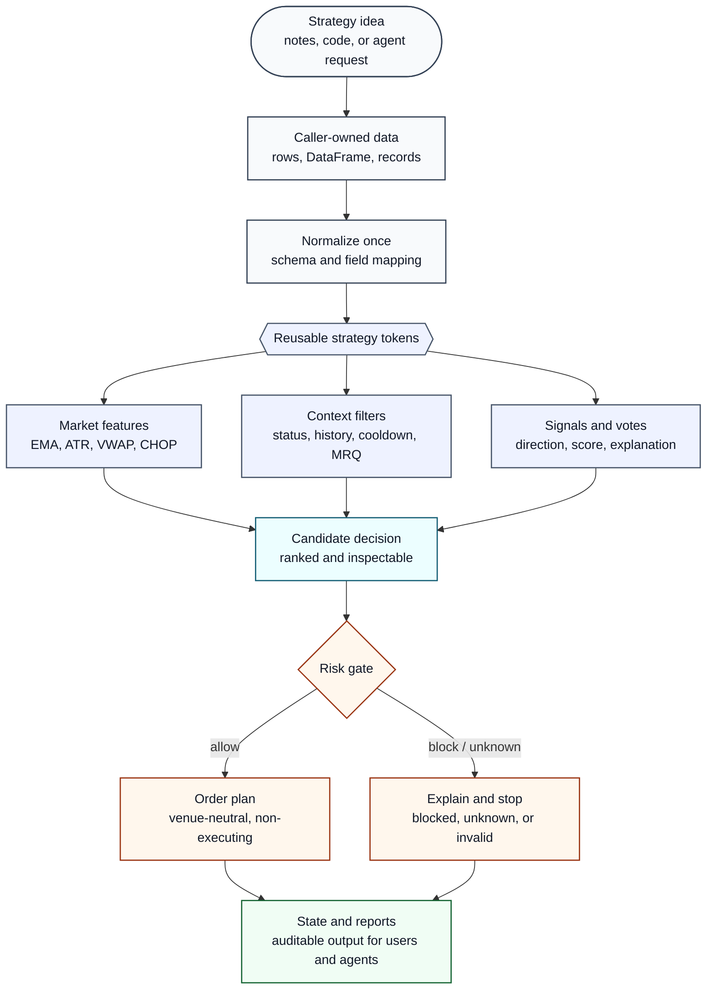

# Quant Strategy Tokenizer

<div align="center">

**Decompose complex trading strategies into small, reusable, auditable strategy tokens.**

`alpha` / `filters` / `risk` / `order planning` / `state` / `agent prompts`


</div>

Quant Strategy Tokenizer (QST) is an agent-oriented toolkit for turning vague strategy ideas, research notes, or full trading codebases into composable financial modules.

It is built for agents and developers who need to inspect, split, recombine, test, and audit strategy logic without hiding uncertainty behind a monolithic runner.

## What It Does

QST treats a strategy as a sequence of explicit decisions:



Each step can be called independently. A user can run only VWAP, only universe filtering, only order planning, or a full pipeline assembled from smaller modules.

## Design Principles

| Principle | Meaning |
| --- | --- |
| Small modules | EMA, VWAP, filters, voting, risk, and order planning are separate callable units. |
| Caller-owned data | Modules process data passed in by the user. They do not fetch live data by themselves. |
| Flexible inputs | Modules accept raw rows, dictionaries, records, or lightly processed DataFrames where practical. |
| Rich outputs | Reports include accepted rows, rejected rows, diagnostics, warnings, and explicit failures. |
| Explicit uncertainty | Missing, unavailable, or unknown states are returned as failures or warnings, not silent success. |
| No hidden execution | QST does not place orders, cancel orders, read live accounts, or mutate deployment state. |

## Project Map

```text
quant-strategy-tokenizer/
  README.md
  pyproject.toml
  quant_strategy_tokenizer/
    contracts.py              shared result, context, event, and failure contracts
    data_schema.py            OHLCV and tabular input validation
    normalization.py          raw input normalization helpers
    row_utils.py              row extraction and typed lookup helpers
    indicators/               EMA, ATR, VWAP, CHOP, spike, rolling return, MRQ touch
    filters/                  blacklist, status, history, cooldown, backoff, VWAP, MRQ
    universe_selector.py      market-neutral symbol selection primitive
    candidate_pool.py         candidate assembly and ranking
    signal_trigger.py         long/short/none trigger generation
    vote_engine.py            judge aggregation and vote reporting
    market_freeze.py          broad-market freeze and observe logic
    order_planner.py          venue-neutral order plan generation
    position_reconciler.py    intended-vs-observed state comparison
    state_model.py            state schema and instance isolation checks
    pipeline.py               deterministic module composition
    reporting.py              redacted JSON/JSONL report writing
    agent_prompts/            reusable prompts for strategy agents
  docs/
    PROJECT_EXPERIENCE.md
    PROJECT_EXPERIENCE_TEMPLATE.md
    SUBMISSION_NOTES.md
```

## Python Dependency Map

Runtime dependency is intentionally small: **Python 3.10+**, **pandas**, and **numpy**. Everything else is standard library.

```text
numpy
pandas
```

| Package | Why QST needs it |
| --- | --- |
| `pandas` | Normalizes tabular market data and powers indicator/report calculations. |
| `numpy` | Supports numerical routines used by CHOP, rolling return, and beta-residual modules. |

There are no live-exchange dependencies in the package: no `ccxt`, no Binance client, no broker SDK, and no credential handling.

The internal Python dependencies are layered so that strategy modules depend downward on shared contracts and helpers. Pure modules do not import live exchange adapters or deployment code.

```mermaid
flowchart TD
    Contracts["contracts.py<br/>ModuleResult, failures, context, schemas"]

    Normalization["normalization.py<br/>raw input to standard tables"]
    RowUtils["row_utils.py<br/>safe row extraction"]
    Reporting["reporting.py<br/>redacted JSON / JSONL output"]
    DataSchema["data_schema.py<br/>tabular validation"]

    Indicators["indicators/*<br/>ema, atr, vwap, chop, spike, rolling return, beta residual, MRQ touch"]
    Filters["filters/*<br/>blacklist, status, history, cooldown, backoff, VWAP, MRQ"]

    Universe["universe_selector.py"]
    Signals["signal_trigger.py"]
    Votes["vote_engine.py"]
    Candidates["candidate_pool.py"]
    Freeze["market_freeze.py"]

    Orders["order_planner.py"]
    Positions["position_reconciler.py"]
    State["state_model.py"]
    Pipeline["pipeline.py"]
    PublicAPI["__init__.py"]

    PublicAPI --> Contracts

    Normalization --> Contracts
    RowUtils --> Contracts
    Reporting --> Contracts
    DataSchema --> Contracts
    DataSchema --> Normalization
    DataSchema --> Reporting

    Indicators --> Contracts
    Indicators --> Normalization
    Indicators --> Reporting

    Filters --> Contracts
    Filters --> RowUtils
    Filters --> Reporting

    Universe --> Contracts
    Universe --> RowUtils
    Universe --> Reporting

    Signals --> Contracts
    Signals --> RowUtils
    Signals --> Reporting

    Votes --> Contracts
    Votes --> RowUtils
    Votes --> Reporting

    Candidates --> Contracts
    Candidates --> RowUtils
    Candidates --> Reporting

    Freeze --> Contracts
    Freeze --> RowUtils
    Freeze --> Reporting

    Orders --> Contracts
    Orders --> RowUtils
    Positions --> Contracts
    State --> Contracts
    Pipeline --> Contracts

    classDef core fill:#f8fafc,stroke:#334155,color:#111827;
    classDef helper fill:#eef2ff,stroke:#475569,color:#111827;
    classDef module fill:#ecfeff,stroke:#155e75,color:#111827;
    classDef plan fill:#fff7ed,stroke:#9a3412,color:#111827;

    class Contracts core;
    class Normalization,RowUtils,Reporting,DataSchema helper;
    class Indicators,Filters,Universe,Signals,Votes,Candidates,Freeze module;
    class Orders,Positions,State,Pipeline,PublicAPI plan;
```



| Layer | Python files | Depends on |
| --- | --- | --- |
| Core contract | `contracts.py` | standard library only |
| Input / output helpers | `normalization.py`, `row_utils.py`, `reporting.py`, `data_schema.py` | `contracts.py`, `pandas` where tabular work is needed |
| Indicators | `indicators/*.py` | `contracts.py`, `normalization.py`, `reporting.py`, `pandas` |
| Filters | `filters/*.py` | `contracts.py`, `row_utils.py`, `reporting.py` |
| Strategy composition | `universe_selector.py`, `signal_trigger.py`, `vote_engine.py`, `candidate_pool.py`, `market_freeze.py` | `contracts.py`, `row_utils.py`, `reporting.py` |
| Planning / state | `order_planner.py`, `position_reconciler.py`, `state_model.py`, `pipeline.py` | `contracts.py`, plus `row_utils.py` where row extraction is needed |

## Minimal Example

```python
from quant_strategy_tokenizer.indicators.ema import EMAParams, EMARequest, run as run_ema

result = run_ema(
    EMARequest(
        data=[
            {"ts": "2026-01-01T00:00:00Z", "close": 100},
            {"ts": "2026-01-01T00:15:00Z", "close": 101},
            {"ts": "2026-01-01T00:30:00Z", "close": 103},
        ],
        params=EMAParams(window=2, min_periods=2),
    )
)

if result.ok:
    print(result.value.last_value)
else:
    print(result.failure.kind, result.failure.message)
```

## Compose Modules

```python
from quant_strategy_tokenizer.pipeline import PipelineStep, run_pipeline
from quant_strategy_tokenizer.indicators.vwap import VWAPRequest, VWAPParams, run as run_vwap

steps = [
    PipelineStep(
        name="vwap",
        fn=lambda data: run_vwap(VWAPRequest(data=data, params=VWAPParams())),
    )
]

result = run_pipeline(
    initial_payload=my_market_rows,
    steps=steps,
)

if result.ok:
    print(result.value.final_payload)
```

The pipeline layer is intentionally thin. It coordinates module calls but keeps data ownership, exchange access, and strategy policy outside the framework.

## Agent Prompts

QST includes prompts that teach another agent how to use, audit, decompose, and extend strategy modules:

| Prompt | Use |
| --- | --- |
| `agent_prompts/10_full_agent_prompt.md` | General-purpose quant engineering agent. |
| `agent_prompts/11_agent_project_usage_guide.md` | Step-by-step QST usage guide with examples. |
| `agent_prompts/12_strategy_code_decomposition_agent.md` | Analyze a full strategy codebase and split it into tokens. |
| `agent_prompts/13_strategy_decomposition_task_template.md` | Fill-in task template for applying the decomposition workflow. |

## Project Background

This project was distilled from a live quantitative strategy engineering process: strategy hardening, incident analysis, backtest realism review, risk-path repair, state isolation, and finally modular decomposition.

See [docs/PROJECT_EXPERIENCE.md](docs/PROJECT_EXPERIENCE.md) for the project experience write-up.

## Installation

```bash
pip install -e .
```

Or install the runtime packages directly:

```bash
pip install -r requirements.txt
```

## Safety Boundary

QST is not a live trading bot. It is a strategy decomposition and composition layer.

Pure modules should not:

- call live exchange APIs;
- place or cancel orders;
- read live account state;
- mutate deployment state;
- treat missing or unknown data as successful empty output.

Execution adapters, credentials, remote deployment scripts, logs, and state files are intentionally outside this public project surface.
