<div align="center">

<h1>Quant Strategy Tokenizer</h1>

**Decompose complex trading strategies into small, reusable, auditable strategy tokens.**

`alpha` / `filters` / `risk` / `order planning` / `state` / `agent prompts`


</div>

Quant Strategy Tokenizer (QST) is an agent-oriented toolkit for turning vague strategy ideas, research notes, or full trading codebases into composable financial modules.

It is built for agents and developers who need to inspect, split, recombine, test, and audit strategy logic without hiding uncertainty behind a monolithic runner.

## What It Does

QST is not a trading bot and not a broker adapter. It is a strategy workbench for agents: a place to break a complex trading system into small pieces, name each piece clearly, test it alone, and then recombine the pieces into research, simulation, or production-adjacent workflows.

The core idea is that a trading strategy should not live as one opaque script. QST encourages every component to declare its inputs, outputs, configuration, failure semantics, and side-effect boundary. That makes it easier for an agent to inspect the strategy, explain what it is doing, and replace one module without rewriting the entire system.

### Built-in Strategy Decomposition Tools

QST ships with prompt assets specifically designed to help agents analyze and decompose complete strategy codebases:

| Tool | Purpose |
| --- | --- |
| [`12_strategy_code_decomposition_agent.md`](quant_strategy_tokenizer/agent_prompts/12_strategy_code_decomposition_agent.md) | Teaches an agent how to read a full strategy codebase and split it into reusable strategy tokens. |
| [`13_strategy_decomposition_task_template.md`](quant_strategy_tokenizer/agent_prompts/13_strategy_decomposition_task_template.md) | Provides a fill-in task template for applying the decomposition workflow to a concrete project. |
| [`11_agent_project_usage_guide.md`](quant_strategy_tokenizer/agent_prompts/11_agent_project_usage_guide.md) | Shows another agent how to call QST modules, inspect outputs, compose workflows safely, and use the indicator tokens. |
| `Params / Request / Report / ModuleResult` contracts | Give each extracted token a predictable interface that can be reused across strategies. |

In practice, an agent can use QST in two directions:

- **Decompose** an existing strategy into alpha, filters, risk, order-planning, state, and reporting tokens.
- **Compose** new workflows by arranging those tokens around user-provided market data.

The operating flow looks like this:


Each step can be called independently. A user can run only VWAP, only universe filtering, only order planning, or a full pipeline assembled from smaller modules.

## Design Principles

| Principle | Meaning |
| --- | --- |
| Small modules | EMA, VWAP, filters, voting, risk, and order planning are separate callable units. |
| Caller-owned data | Modules process data passed in by the user. They do not fetch live data by themselves. |
| Flexible inputs | Modules accept raw rows, dictionaries, records, or lightly processed DataFrames where practical. |
| Rich outputs | Reports include accepted rows, rejected rows, diagnostics, warnings, and explicit failures. |
| Explicit uncertainty | Missing, unavailable, or unknown states are returned as failures or warnings, not silent success. |
| No hidden execution | QST does not place orders, cancel orders, read live accounts, or mutate deployment state. |

## Project Map

```text
Quant-Strategy-Tokenizer/
  README.md
  pyproject.toml
  quant_strategy_tokenizer/
    contracts.py              shared result, context, event, and failure contracts
    data_schema.py            OHLCV and tabular input validation
    normalization.py          raw input normalization helpers
    row_utils.py              row extraction and typed lookup helpers
    indicators/               EMA, ATR, VWAP, CHOP, spike, rolling return, MRQ, trend, momentum, and volatility tokens
    filters/                  blacklist, status, history, cooldown, backoff, VWAP, MRQ
    universe_selector.py      market-neutral symbol selection primitive
    candidate_pool.py         candidate assembly and ranking
    signal_trigger.py         long/short/none trigger generation
    vote_engine.py            judge aggregation and vote reporting
    market_freeze.py          broad-market freeze and observe logic
    order_planner.py          venue-neutral order plan generation
    position_reconciler.py    intended-vs-observed state comparison
    state_model.py            state schema and instance isolation checks
    pipeline.py               deterministic module composition
    reporting.py              redacted JSON/JSONL report writing
    agent_prompts/            reusable prompts for strategy agents
  docs/
    PROJECT_EXPERIENCE.md
    PROJECT_EXPERIENCE_TEMPLATE.md
    SUBMISSION_NOTES.md
  tests/
    test_core_behaviors.py
    test_trend_indicators.py
    test_momentum_indicators.py
    test_volatility_indicators.py
```

## Python Dependency Map

Runtime dependency is intentionally small: **Python 3.10+**, **pandas**, and **numpy**. Everything else is standard library. TA-Lib is supported only as an optional indicator backend.

```text
numpy
pandas
# Optional:
TA-Lib
```

| Package | Why QST needs it |
| --- | --- |
| `pandas` | Normalizes tabular market data and powers indicator/report calculations. |
| `numpy` | Supports numerical routines used by indicator and feature modules. |
| `TA-Lib` | Optional backend for users who need parity with supported indicator tokens. Native pandas/numpy implementations remain the default. |

There are no live-exchange dependencies in the package: no `ccxt`, no Binance client, no broker SDK, and no credential handling.

The internal Python dependencies are layered so that strategy modules depend downward on shared contracts and helpers. Pure modules do not import live exchange adapters or deployment code.

```mermaid
flowchart TD
    Contracts["contracts.py<br/>ModuleResult, failures, context, schemas"]

    Normalization["normalization.py<br/>raw input to standard tables"]
    RowUtils["row_utils.py<br/>safe row extraction"]
    Reporting["reporting.py<br/>redacted JSON / JSONL output"]
    DataSchema["data_schema.py<br/>tabular validation"]

    Indicators["indicators/*<br/>ema, atr, vwap, chop, spike, rolling return, beta residual, MRQ touch, trend, momentum, and volatility tokens"]
    Filters["filters/*<br/>blacklist, status, history, cooldown, backoff, VWAP, MRQ"]

    Universe["universe_selector.py"]
    Signals["signal_trigger.py"]
    Votes["vote_engine.py"]
    Candidates["candidate_pool.py"]
    Freeze["market_freeze.py"]

    Orders["order_planner.py"]
    Positions["position_reconciler.py"]
    State["state_model.py"]
    Pipeline["pipeline.py"]
    PublicAPI["__init__.py"]

    PublicAPI --> Contracts

    Normalization --> Contracts
    RowUtils --> Contracts
    Reporting --> Contracts
    DataSchema --> Contracts
    DataSchema --> Normalization
    DataSchema --> Reporting

    Indicators --> Contracts
    Indicators --> Normalization
    Indicators --> Reporting

    Filters --> Contracts
    Filters --> RowUtils
    Filters --> Reporting

    Universe --> Contracts
    Universe --> RowUtils
    Universe --> Reporting

    Signals --> Contracts
    Signals --> RowUtils
    Signals --> Reporting

    Votes --> Contracts
    Votes --> RowUtils
    Votes --> Reporting

    Candidates --> Contracts
    Candidates --> RowUtils
    Candidates --> Reporting

    Freeze --> Contracts
    Freeze --> RowUtils
    Freeze --> Reporting

    Orders --> Contracts
    Orders --> RowUtils
    Positions --> Contracts
    State --> Contracts
    Pipeline --> Contracts

    classDef core fill:#f8fafc,stroke:#334155,color:#111827;
    classDef helper fill:#eef2ff,stroke:#475569,color:#111827;
    classDef module fill:#ecfeff,stroke:#155e75,color:#111827;
    classDef plan fill:#fff7ed,stroke:#9a3412,color:#111827;

    class Contracts core;
    class Normalization,RowUtils,Reporting,DataSchema helper;
    class Indicators,Filters,Universe,Signals,Votes,Candidates,Freeze module;
    class Orders,Positions,State,Pipeline,PublicAPI plan;
```



| Layer | Python files | Depends on |
| --- | --- | --- |
| Core contract | `contracts.py` | standard library only |
| Input / output helpers | `normalization.py`, `row_utils.py`, `reporting.py`, `data_schema.py` | `contracts.py`, `pandas` where tabular work is needed |
| Indicators | `indicators/*.py` | `contracts.py`, `normalization.py`, `reporting.py`, `pandas` |
| Filters | `filters/*.py` | `contracts.py`, `row_utils.py`, `reporting.py` |
| Strategy composition | `universe_selector.py`, `signal_trigger.py`, `vote_engine.py`, `candidate_pool.py`, `market_freeze.py` | `contracts.py`, `row_utils.py`, `reporting.py` |
| Planning / state | `order_planner.py`, `position_reconciler.py`, `state_model.py`, `pipeline.py` | `contracts.py`, plus `row_utils.py` where row extraction is needed |

## Minimal Example

```python
from quant_strategy_tokenizer.indicators.ema import EMAParams, EMARequest, run as run_ema

result = run_ema(
    EMARequest(
        data=[
            {"ts": "2026-01-01T00:00:00Z", "close": 100},
            {"ts": "2026-01-01T00:15:00Z", "close": 101},
            {"ts": "2026-01-01T00:30:00Z", "close": 103},
        ],
        params=EMAParams(window=2, min_periods=2),
    )
)

if result.ok:
    print(result.value.last_value)
else:
    print(result.failure.kind, result.failure.message)
```

## Compose Modules

```python
from quant_strategy_tokenizer.contracts import ModuleResult
from quant_strategy_tokenizer.pipeline import PipelineStep, run_pipeline
from quant_strategy_tokenizer.indicators.ema import EMARequest, EMAParams, run as run_ema
from quant_strategy_tokenizer.indicators.vwap import VWAPRequest, VWAPParams, run as run_vwap

steps = [
    PipelineStep(
        name="vwap",
        input_key="initial",
        output_key="vwap_deviation",
        take="last_deviation",
        fn=lambda data: run_vwap(VWAPRequest(data=data, params=VWAPParams(window=2))),
    ),
    PipelineStep(
        name="ema",
        input_key="initial",
        output_key="ema_last",
        take="last_value",
        fn=lambda data: run_ema(EMARequest(data=data, params=EMAParams(window=2, min_periods=2))),
    ),
    PipelineStep(
        name="summary",
        pass_state=True,
        fn=lambda state: ModuleResult.success(
            {
                "ema": state.get("ema_last"),
                "vwap_deviation": state.get("vwap_deviation"),
                "vwap_touches": state.get("vwap.touch_count"),
            }
        ),
    ),
]

result = run_pipeline(
    initial_payload=my_market_rows,
    steps=steps,
)

if result.ok:
    print(result.value.final_payload)
```

The pipeline layer is a small data bus, not a hidden runner. `input_key` selects data from the bus, `take` selects fields from a module report, `output_key` stores reusable downstream payloads, and `pass_state=True` lets a step combine multiple previous outputs. Data fetching, exchange access, and strategy policy still stay outside the framework.

## Trend Indicator Tokens

QST includes atomic trend indicators under `quant_strategy_tokenizer.indicators`. Each trend token follows the same interface:

```text
Params / Request / Report / normalize_input(request) / run(request)
```

Modules accept caller-supplied rows, dictionaries, lists, pandas Series, or pandas DataFrames where practical. They never fetch market data. Output is a `ModuleResult[TrendReport]` with `last_value`, `last_values`, `trend_direction`, `trend_strength`, `signal`, `summary`, `used_fields`, warnings, diagnostics, and optional full series when `DetailLevel.FULL` is requested.

```python
from quant_strategy_tokenizer.indicators.supertrend import (
    SupertrendParams,
    SupertrendRequest,
    run as run_supertrend,
)

result = run_supertrend(
    SupertrendRequest(
        data=my_ohlc_rows,
        params=SupertrendParams(atr_window=10, multiplier=3.0),
    )
)

if result.ok:
    print(result.value.trend_direction, result.value.signal)
else:
    print(result.failure.kind, result.failure.message)
```

Backend selection is explicit. `backend="native"` uses pandas/numpy and is the default. `backend="talib"` requires TA-Lib and fails with `unavailable_backend` if TA-Lib is not installed. `backend="auto"` uses TA-Lib only when it is installed and implemented for that token; otherwise it stays on the native implementation.

Install the optional TA-Lib backend only when needed:

```bash
python -m pip install -e ".[talib]"
```

| Family | Tokens |
| --- | --- |
| Moving averages | `sma`, `wma`, `smma`, `dema`, `tema`, `trima`, `t3`, `hma`, `kama`, `zlema`, `mcginley_dynamic`, `vwma` |
| Trend/momentum hybrids | `macd`, `ppo`, `apo` |
| Direction and strength | `adx`, `adxr`, `dmi`, `aroon`, `aroon_oscillator`, `vortex` |
| Trend stops and channels | `parabolic_sar`, `supertrend`, `donchian_channel`, `keltner_channel`, `chandelier_exit`, `atr_trailing_stop` |
| Structured trend systems | `ichimoku_cloud`, `alligator`, `ma_cross`, `ma_ribbon`, `gmma` |
| Linear regression trend | `linear_regression`, `linear_regression_slope`, `linear_regression_angle`, `linear_regression_r2`, `least_squares_moving_average`, `time_series_forecast` |
| Hilbert / MESA / Ehlers | `mama`, `ht_trendline`, `ht_trendmode`, `ht_sinewave`, `ht_phasor`, `ht_dominant_cycle_period`, `ht_dominant_cycle_phase` |
| Composite trend scoring | `trend_strength_index`, `chande_trend_meter` |

## Momentum Indicator Tokens

QST also includes atomic momentum indicators under `quant_strategy_tokenizer.indicators`. Momentum tokens use the same interface as trend tokens:

```text
Params / Request / Report / normalize_input(request) / run(request)
```

They return `ModuleResult[MomentumReport]` with `last_value`, `last_values`, `momentum_direction`, `momentum_strength`, `signal`, `zone`, threshold metadata, optional full series, field mappings, warnings, and diagnostics.

```python
from quant_strategy_tokenizer.indicators.rsi import RSIParams, RSIRequest, run as run_rsi

result = run_rsi(
    RSIRequest(
        data=my_price_rows,
        params=RSIParams(window=14, overbought=70, oversold=30),
    )
)

if result.ok:
    print(result.value.last_value, result.value.zone)
else:
    print(result.failure.kind, result.failure.message)
```

| Family | Tokens |
| --- | --- |
| Bounded oscillators | `rsi`, `stochastic_oscillator`, `stochastic_fast`, `stochastic_rsi`, `cci`, `cmo`, `williams_r`, `ultimate_oscillator`, `mfi`, `demarker`, `relative_momentum_index` |
| Rate-of-change | `momentum`, `roc`, `rocp`, `rocr`, `rocr100`, `trix`, `dpo`, `chande_forecast_oscillator` |
| Multi-line momentum | `kst`, `true_strength_index`, `relative_vigor_index`, `fisher_transform`, `stochastic_momentum_index`, `kdj` |
| Price/volume pressure | `bop`, `awesome_oscillator`, `accelerator_oscillator`, `elder_ray`, `qstick`, `coppock_curve`, `connors_rsi` |

## Volatility Indicator Tokens

QST includes atomic volatility indicators for range, return-volatility, bands, squeeze states, drawdown risk, and volatility regimes. They follow the same public interface:

```text
Params / Request / Report / normalize_input(request) / run(request)
```

They return `ModuleResult[VolatilityReport]` with `last_value`, `last_values`, `volatility_direction`, `volatility_level`, `signal`, `regime`, `normalized_value`, optional full series, field mappings, warnings, and diagnostics.

```python
from quant_strategy_tokenizer.indicators.volatility_regime import (
    VolatilityRegimeParams,
    VolatilityRegimeRequest,
    run as run_volatility_regime,
)

result = run_volatility_regime(
    VolatilityRegimeRequest(
        data=my_price_rows,
        params=VolatilityRegimeParams(window=20, regime_window=100),
    )
)

if result.ok:
    print(result.value.regime, result.value.normalized_value)
else:
    print(result.failure.kind, result.failure.message)
```

| Family | Tokens |
| --- | --- |
| Range / ATR | `true_range`, `natr`, `high_low_range`, `rolling_range`, `average_range`, `gap_range`, `range_percent`, `range_expansion` |
| Statistical volatility | `rolling_stddev`, `rolling_variance`, `historical_volatility`, `realized_volatility`, `ewma_volatility`, `parkinson_volatility`, `garman_klass_volatility`, `rogers_satchell_volatility`, `yang_zhang_volatility`, `downside_volatility`, `volatility_of_volatility` |
| Bands and squeeze | `bollinger_bands`, `bollinger_bandwidth`, `percent_b`, `zscore`, `zscore_bands`, `ttm_squeeze`, `bollinger_keltner_squeeze` |
| Regime and special | `chaikin_volatility`, `mass_index`, `ulcer_index`, `relative_volatility_index`, `inertia`, `vertical_horizontal_filter`, `volatility_ratio`, `volatility_regime` |

## Agent Prompts

QST includes prompts that teach another agent how to use, audit, decompose, and extend strategy modules:

| Prompt | Use |
| --- | --- |
| `agent_prompts/10_full_agent_prompt.md` | General-purpose quant engineering agent. |
| `agent_prompts/11_agent_project_usage_guide.md` | Step-by-step QST usage guide with trend, momentum, and volatility indicator token examples. |
| `agent_prompts/12_strategy_code_decomposition_agent.md` | Analyze a full strategy codebase and split it into tokens. |
| `agent_prompts/13_strategy_decomposition_task_template.md` | Fill-in task template for applying the decomposition workflow. |

## Project Background

This project was distilled from a live quantitative strategy engineering process: strategy hardening, incident analysis, backtest realism review, risk-path repair, state isolation, and finally modular decomposition.

See [docs/PROJECT_EXPERIENCE.md](docs/PROJECT_EXPERIENCE.md) for the project experience write-up.

## License

Quant Strategy Tokenizer is released under the [MIT License](LICENSE).

## Installation

Clone the repository first:

```bash
git clone https://github.com/waswrsis/Quant-Strategy-Tokenizer.git
cd Quant-Strategy-Tokenizer
```

Install QST in editable mode. This installs the local `quant_strategy_tokenizer` package and the runtime dependencies declared in `pyproject.toml`.

```bash
python -m pip install -e .
```

Verify the install:

```bash
python -c "import quant_strategy_tokenizer as qst; print(qst.__file__)"
```

If you only want the third-party runtime packages without installing the QST package itself, use:

```bash
python -m pip install -r requirements.txt
```

That command installs only `numpy` and `pandas`. It does not install `quant_strategy_tokenizer` as an importable package.

## Safety Boundary

QST is not a live trading bot. It is a strategy decomposition and composition layer.

Pure modules should not:

- call live exchange APIs;
- place or cancel orders;
- read live account state;
- mutate deployment state;
- treat missing or unknown data as successful empty output.

Execution adapters, credentials, remote deployment scripts, logs, and state files are intentionally outside this public project surface.
